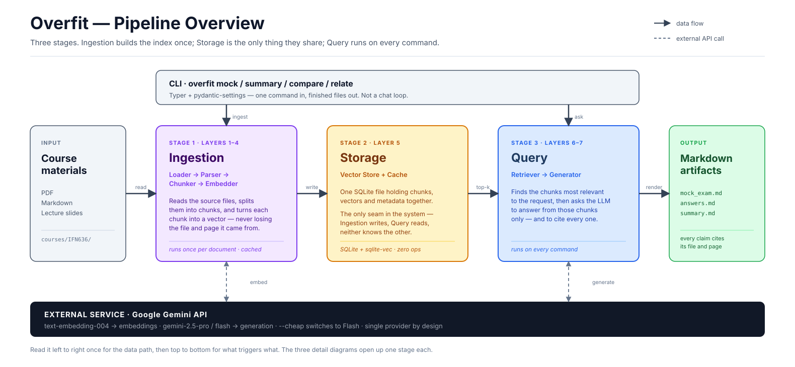
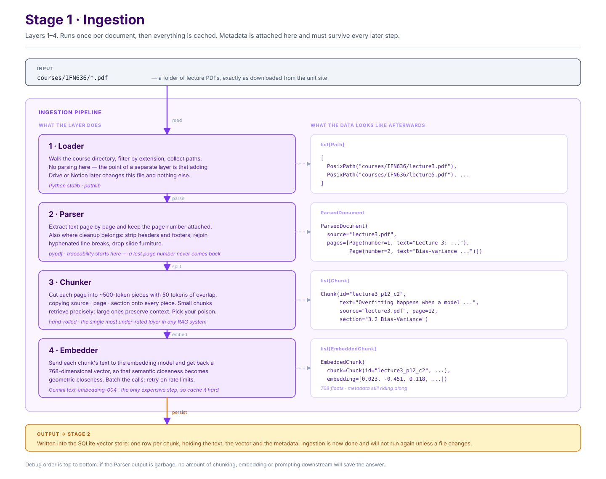
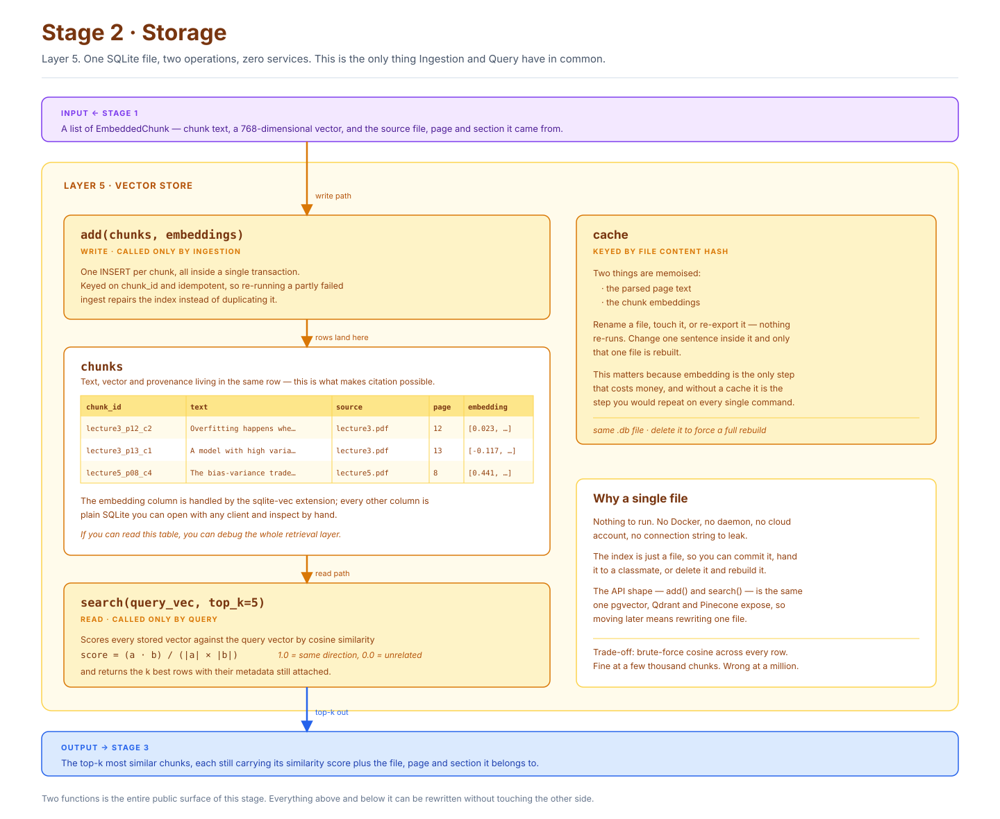
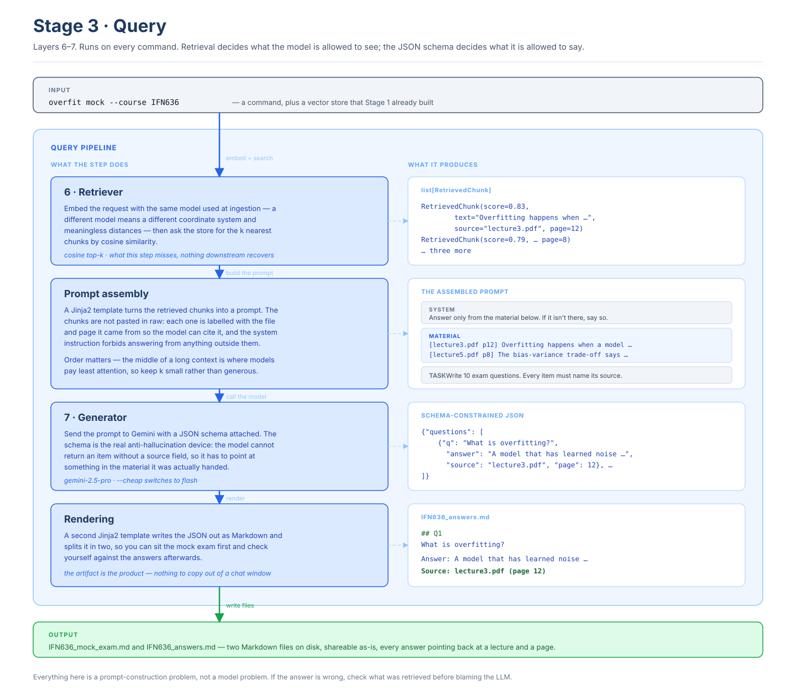

# 🏗️ Overfit Architecture

> 图解版。逐层文字说明见 [PIPELINE.md](./PIPELINE.md)，选型理由见 [TECH-STACK.md](./TECH-STACK.md)，模型配置见 [MODELS.md](./MODELS.md)。

Overfit is a hand-written RAG pipeline: seven layers, one storage file, no framework in between. These four diagrams go from the whole system down to individual stages.

Start with the overview. Open a stage diagram only when you need to work on that stage.

| Diagram | What it answers |
| --- | --- |
| [Overview](#overview) | How do the three stages fit together, and what triggers what? |
| [Stage 1 · Ingestion](#stage-1--ingestion) | How do documents become vectors without losing their origin? |
| [Stage 2 · Storage](#stage-2--storage) | What exactly is stored, and what is the API around it? |
| [Stage 3 · Query](#stage-3--query) | How does a command turn into a cited, structured Markdown file? |

Source files live in [`docs/diagrams/`](./diagrams/) as SVG. They import into Figma as editable layers — drag the file in, every panel, card and arrow arrives as a named layer.

---

## Overview

Three stages, and the important thing about them is the asymmetry:

- **Ingestion runs once** per document and is cached. It is slow and costs money.
- **Query runs on every command.** It must be fast and cheap.
- **Storage is the only thing they share.** Ingestion writes, Query reads, and neither knows how the other is implemented. Every future upgrade — re-ranking, hybrid search, a different embedding model, swapping SQLite for pgvector — happens on one side of that seam without disturbing the other.

RAG itself is not a model technique. It is a **prompt-construction strategy**: keep the knowledge outside the model, and at question time retrieve only the small part that matters. Which means the ceiling of the whole system is set by retrieval, not by the LLM.

---

## Stage 1 · Ingestion

Layers 1–4: Loader → Parser → Chunker → Embedder.

The left column is what each layer does; the right column is what the data actually looks like when it comes out. Two things are worth internalising:

**Metadata is created in the Parser and can only be carried, never recovered.** If page numbers are dropped when the PDF is read, no downstream layer can reconstruct them, and the citation feature dies quietly. Every data structure from `Chunk` onwards carries `source`, `page` and `section` — that is not decoration, it is the product.

**Chunking is where most RAG systems actually fail.** Small chunks retrieve precisely but lose context; large chunks preserve context but dilute the vector until it means nothing specific. Overlap is the patch that stops a sentence being severed at a boundary. There is no universally right size — but there is a right way to find out, which is to print ten real chunks and read them.

A third, less obvious one: **PDF is a print format, not a semantic one.** Headers, footers, hyphenated line breaks and two-column bleed all end up inside your embeddings if you don't strip them. Cleaning belongs in the Parser, before anything is measured.

---

## Stage 2 · Storage

Layer 5, and the entire public surface is two functions: `add()` and `search()`.

Chunk text, its vector, and its provenance live **in the same row**. That co-location is what makes citation possible at all — retrieval hands back not just relevant text but the file and page it came from, in one step, with no second lookup.

The cache is keyed by **file content hash**, not filename or timestamp. Renaming, touching or re-exporting a file changes neither the hash nor the work required; editing one sentence rebuilds exactly one file. Since embedding is the only step that costs money, this is where the project's running cost is actually decided.

Choosing SQLite over a vector database is deliberate. The index becomes a file you can commit, copy, inspect by hand, or delete and rebuild — and `add()` / `search()` is the same shape pgvector, Qdrant and Pinecone expose, so migrating later means rewriting one module. The trade-off is honest: brute-force cosine across every row is fine at a few thousand chunks and wrong at a million.

---

## Stage 3 · Query

Layers 6–7, plus the two glue steps that matter as much as the layers themselves.

**Retrieval sets the ceiling.** The query must be embedded with the same model used at ingestion — a different model is a different coordinate system, and the distances become meaningless. And note the limitation of pure vector search: `"what is overfitting"` and a chunk about *underfitting* sit very close together in embedding space, but only one of them answers the question. This is exactly the gap that hybrid search and re-ranking exist to close, and exactly why the MVP leaves them out and measures first.

**The prompt is assembled, not concatenated.** Each chunk goes in labelled with its file and page so the model has something to cite, and the system instruction restricts the answer to that material. Keep `k` small: models pay least attention to the middle of a long context, so more retrieved chunks is not linearly more accuracy.

**The JSON schema is the anti-hallucination clamp.** Requiring a `source` field on every generated item forces the model to point at something it was given. That constraint is enforceable in a way that "please don't make things up" is not.

---

## Debugging order

Failures compound downstream, so always debug from the top:

| # | Failure | Symptom | How to check |
| :--: | --- | --- | --- |
| 1 | **Extraction** | garbled text, missing content, scrambled columns | print a few pages of Parser output |
| 2 | **Chunking** | meaning severed mid-thought | read ten random chunks yourself |
| 3 | **Recall** | the right chunk never enters top-k | look up the rank of a chunk you know is correct |
| 4 | **Ranking** | it enters top-k but drowns in noise | print the score distribution |
| 5 | **Generation** | correct material given, model ignored it | inspect the fully assembled prompt |

Only #5 has anything to do with how good the model is. **RAG is an engineering problem, not a model problem.**
