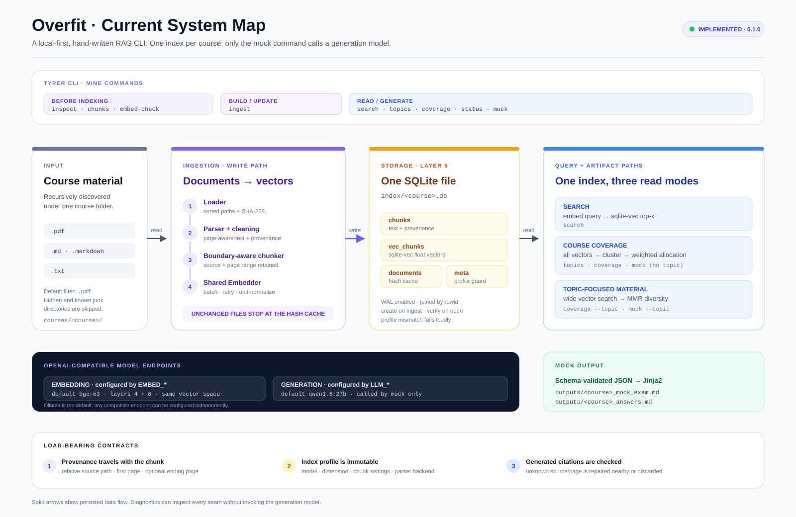
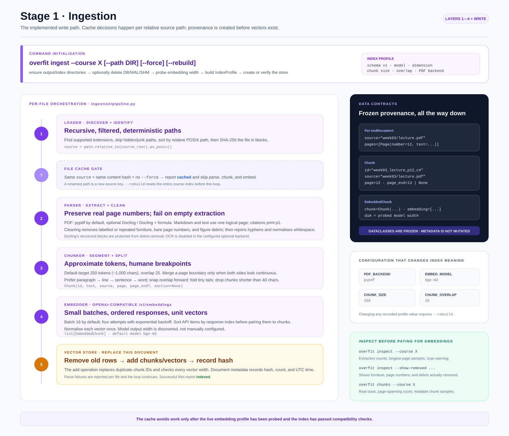
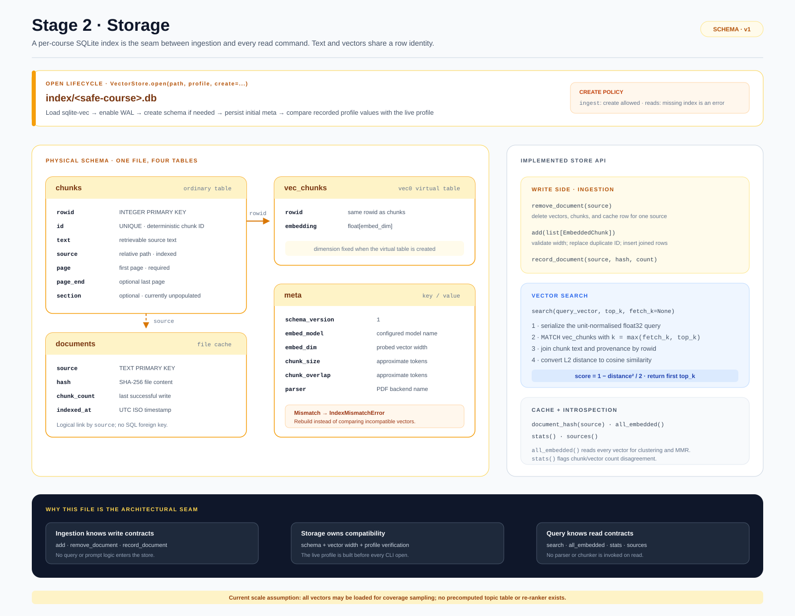
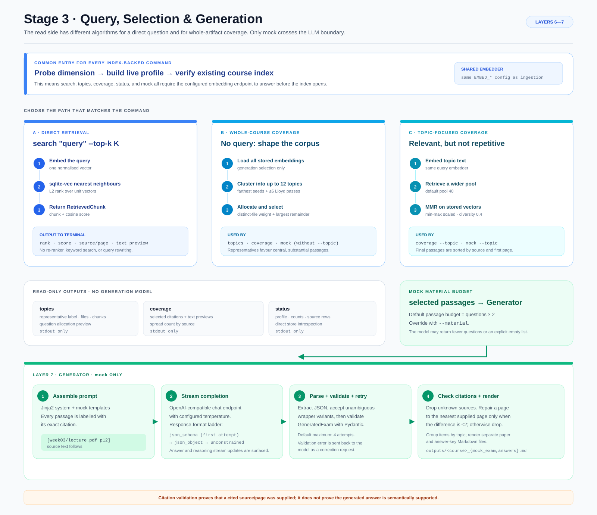
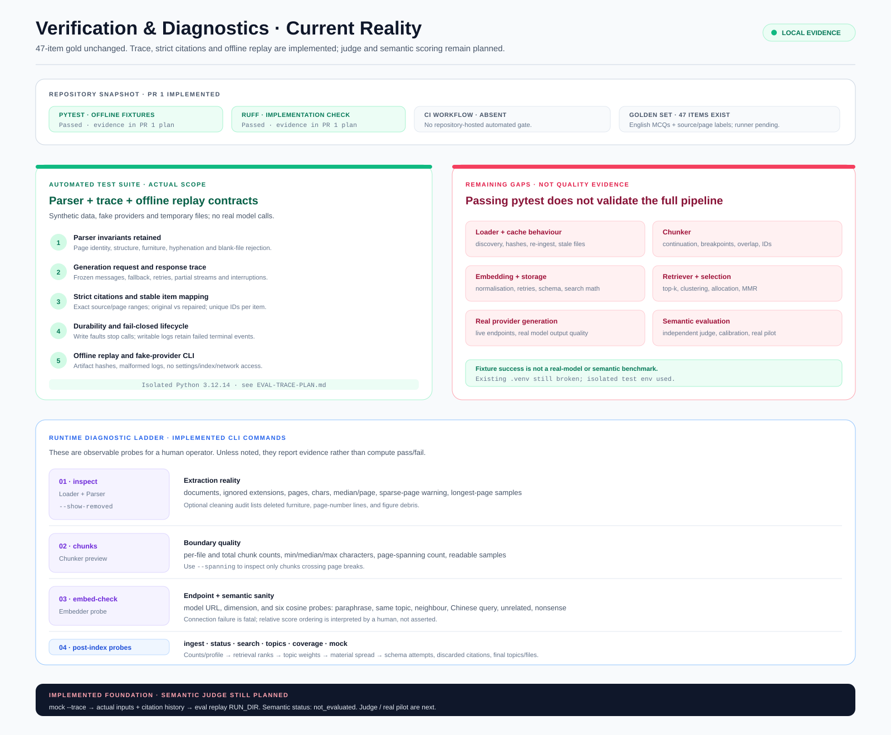

# 🏗️ Overfit Architecture

> 本文描述的是当前 `ai-dev` 分支已经实现的架构。逐层行为见
> [PIPELINE.md](./PIPELINE.md)，选型与依赖见
> [TECH-STACK.md](./TECH-STACK.md)，模型边界见
> [MODELS.md](./MODELS.md)。

Overfit 是一条本地优先、手写且可检查的 RAG 内容生产流水线。系统由七层组成，
每门课程使用一个 SQLite 索引文件；没有 LangChain、LlamaIndex，也没有独立的向量
数据库服务。CLI 负责把各层编排为诊断、建库、检索、选材和试卷生成命令。

本文中的五张图均对应当前实现，SVG 源文件位于
[`docs/diagrams/`](./diagrams/)，可直接导入 Figma。

| 图 | 回答的问题 |
| --- | --- |
| [System overview](#system-overview) | 文件、索引、命令和模型服务如何连接？ |
| [Ingestion](#stage-1--ingestion) | 文档如何变成保留出处的向量？ |
| [Storage](#stage-2--storage) | SQLite 中实际存什么，哪些配置会使索引失效？ |
| [Query and generation](#stage-3--query-and-generation) | 搜索、选材和生成分别走哪条路径？ |
| [Diagnostics](#diagnostics-and-verification) | 当前有哪些可执行检查，覆盖到哪里？ |

---

## System overview

系统有三个运行阶段，彼此并不对称：

1. **Pre-index diagnostics**：`inspect` 和 `chunks` 直接读取课程目录，不访问
   embedding 服务，也不创建数据库。它们让人先检查解析和分块，再支付建库成本。
2. **Ingestion**：`ingest` 执行 Loader → Parser → Chunker → Embedder，并写入该课程
   自己的 `index/<course>.db`。未变化文件由 SHA-256 内容 hash 跳过。
3. **Query / artifact production**：`search`、`topics`、`coverage`、`status` 和
   `mock` 只读取索引；其中只有 `mock` 调用生成模型并写入 Markdown。

Embedding 服务同时服务建库和查询。两侧调用同一个 `Embedder`，因此不会不小心用
两个实现生成不兼容的向量。生成模型只存在于 Layer 7，可以在不重建索引的情况下
更换。

### 当前 CLI 表面

| 命令 | 需要索引 | 调用 embedding | 调用生成 LLM | 写文件 | 作用 |
| --- | :---: | :---: | :---: | :---: | --- |
| `inspect` | ❌ | ❌ | ❌ | ❌ | 查看 Parser 输出和可选的清理删除记录 |
| `chunks` | ❌ | ❌ | ❌ | ❌ | 预览真实 chunk、大小和跨页情况 |
| `embed-check` | ❌ | 维度探测 + probes | ❌ | ❌ | 检查维度和跨语言语义排序 |
| `ingest` | 创建/更新 | 维度探测 + chunks | ❌ | ✅ DB | 增量建库；`--rebuild` 可完全重建 |
| `status` | ✅ | 维度探测 | ❌ | ❌ | 展示索引 profile、数量和来源 |
| `search` | ✅ | 维度探测 + query | ❌ | ❌ | 直接查看向量检索结果 |
| `topics` | ✅ | 维度探测 | ❌ | ❌ | 聚类并按跨文档权重排列主题 |
| `coverage` | ✅ | 维度探测；topic 另 embed query | ❌ | ❌ | 预览生成命令将看到的材料 |
| `mock` | ✅ | 维度探测；topic 另 embed query | ✅ | ✅ MD | 生成题卷和独立答案文件 |

`status`、`topics` 等命令打开索引时仍会读取当前 embedding profile，并通过一次维度
探测获得 `embed_dim`。这一步用于拒绝不兼容索引，不等于重新计算课程向量。

---

## Stage 1 · Ingestion

### Layer 1 — Loader

Loader 递归扫描课程目录，按相对路径稳定排序，并跳过隐藏路径、`.git`、
`node_modules`、`__MACOSX` 等非课程内容。代码能够解析 `.pdf`、`.md`、
`.markdown` 和 `.txt`，但默认 `EXTENSIONS=.pdf`；要索引文本格式必须显式修改过滤器。

相对路径就是文档身份。例如 `week1/notes.md` 和 `week2/notes.md` 是两个 source，
不会因文件名相同互相覆盖。每个文件还会计算 SHA-256 内容 hash；只有“相对 source
相同且 hash 相同”的文件才会被增量建库跳过。

### Layer 2 — Parser

Parser 的输出是 `ParsedDocument(source, pages)`。每个 `Page` 在创建时就获得 1-based
页码；后面的清理会重建 `Page`，但不得删除或重排页号。

当前后端：

- `pypdf`：默认、轻量、逐页抽取；
- `docling`：可选的布局/表格感知 PDF 后端；
- `docling+formula`：在 Docling 基础上开启公式 enrichment；
- Markdown / text：UTF-8 读取为一个逻辑页；当前 citation 会显示合成的 `p1`，
  但它不代表源文件中真实存在的物理页。

清理阶段会记录或处理 running furniture、裸页码、图表碎片、断行连字符、多余空白。
Docling 提供的 furniture/structured 标签优先于统计猜测；未标注后端只在至少四页时
用 60% 边缘重复率判断页眉页脚。OCR 当前关闭；image-only 或抽取清洗后全空的
扫描件会以 `EmptyExtractionError` 失败，仍能抽出少量文字的文件则只会触发
scan heuristic 提示，不会自动进入 OCR 流程。

### Layer 3 — Chunker

Chunk 大小配置使用近似 token，实际按 `1 token ≈ 4 chars` 计算。实现不是固定位置
硬切：它依次偏好段落、行、句子、词边界，并把 overlap 起点吸附到可读边界。

页面不是无条件边界。如果上一页没有终止标点，且下一页以小写继续，两个页面会被
放进同一连续 segment；其他情况保守地断开。跨页 chunk 同时保存 `page` 和
`page_end`。小于 40 字符的碎片不进入索引，过短尾部会并回前一块。

当前 `Chunk` 数据结构保留了可选 `section` 字段，数据库也能存它，但现有 Parser /
Chunker 尚未填充该字段；当前可兑现的引用粒度是 `source + page/page range`。

### Layer 4 — Embedder

`Embedder` 使用 OpenAI-compatible `/v1/embeddings` 接口。它会：

- 以 16 条为默认 batch；
- 最多尝试 4 次并指数退避；
- 按 API 返回的 `index` 重排，保证文本和向量没有错配；
- 把向量归一化为单位长度；
- 用一次 probe 请求发现真实维度，而不是让人手填。

Pipeline 逐文件隔离 Parser 类失败：一个坏文件不会阻止其余文档建库。Embedding
请求失败发生在解析之后，目前会终止整个 ingest，而不是记为单文件 `failed`。

---

## Stage 2 · Storage

每门课程对应一个 SQLite 文件，使用 WAL 模式和 `sqlite-vec`。当前 schema 包含四个
数据库对象：

| 对象 | 内容 |
| --- | --- |
| `meta` | schema、embedding、chunk 和 parser profile |
| `documents` | `source`、SHA-256 hash、chunk 数量、建库时间 |
| `chunks` | 文本、相对 source、page range、可选 section |
| `vec_chunks` | 与 `chunks.rowid` 一一对应的 float32 向量虚拟表 |

Chunk 和 vector 在同一事务内写入，并通过 rowid 一一对应；重建一个文件前，旧 chunk
和 vector 会一起删除，避免缩短后的文件遗留孤儿块。`stats()` 会比较两张表的数量，
`ingest` 在不一致时打印警告。

### Index profile 护栏

以下字段写入 `meta`，打开索引时逐项核对：

- `schema_version`
- `embed_model`
- `embed_dim`
- `chunk_size`
- `chunk_overlap`
- `parser`

新索引会写全以上字段；已存在且值不匹配的字段会抛出 `IndexMismatchError` 并要求
`overfit ingest --rebuild`。但当前兼容逻辑把旧索引中**缺失的 meta key**当作当前值
接受，所以它不是 schema migration 或完整的旧库验证机制。检索参数和生成模型不
属于索引 profile，因为它们不改变存储文本或向量。

当前 profile **没有记录 embedding runtime、具体软件版本或清理规则版本**。修改
Parser 清理代码但保持 backend 名称不变时，应使用 `ingest --force`；如果 chunk 或
embedding profile 改变，则使用 `--rebuild`。

当前增量流程也不会主动清除已从课程目录删除、改名或被 `EXTENSIONS` 新过滤掉的
source。这些旧 chunk 会留在索引中；发生上述变化后应使用 `--rebuild`，而不是只跑
普通 `ingest`。

---

## Stage 3 · Query and generation

Query 侧有三种不同操作，不能统称为一次普通 top-k：

### Direct retrieval

`search` 把 query 交给同一个 `Embedder`，再由 sqlite-vec 做近邻查询。因为写入向量
已经归一化，store 将 squared L2 distance 精确换算成 cosine similarity。当前没有
hybrid search、metadata filtering、cross-encoder re-ranking 或 query rewriting；
`fetch_k` 只是为未来较宽候选池预留的接口。

### Corpus-wide selection

`mock` 没有 topic 时不会把课程名当 query 做 top-k，而是读取所有已存向量：

1. 过滤不适合出题的过短 chunk（必要时放宽）；
2. farthest-point seeds 初始化；
3. 最多六轮 Lloyd-style dot-product assignment（输入向量已单位化，更新后的
   centroid 当前不会再次单位化）；
4. 每个 cluster 选择兼顾中心度与长度的代表；
5. 按“覆盖该主题的不同文件数”计算权重；
6. 先给能覆盖的主题各一个名额，再用 largest remainder 分配剩余题量；
7. 在主题内再次聚类，避免 worksheet 与答案等近重复材料。

`topics` 展示同一聚类与分配结果，`coverage` 展示实际选中的材料。两者都不调用生成
模型，因此是可检查的生成前诊断。

### Topic-focused selection

指定 `mock --topic` 或 `coverage --topic` 时，系统先检索一个较宽候选池，再以
Maximal Marginal Relevance（MMR）平衡 query 相关性和候选之间的重复度。MMR 的
两项分数都先 min-max 到 `[0,1]`，避免 cosine 分布过窄使 diversity 参数失效。

### Layer 7 — Generator

Generator 把带 `[source pN]` 标签的 chunk 渲染进 Jinja2 prompt，并通过 OpenAI-
compatible chat completions 流式生成。结构化输出采用逐级降级：

1. 严格 `json_schema`；
2. `json_object`；
3. 无 response format，再从回复中提取 JSON。

响应通过 Pydantic `GeneratedExam` 校验。失败时错误会反馈给模型并重试；合理但不同
的 wrapper 形状（裸数组、`questions` 等单列表字段）会被无歧义地归一化。校验之后
还会把每条 citation 与实际提供的 chunk 核对：不存在的 source 或远离材料范围的
page 会被丢弃，最多相差两页的近误差会修正到最近允许页。

最终输出两个文件：`<course>_mock_exam.md` 与 `<course>_answers.md`。题目按模型给出的
topic 分组；当前没有 multiple-choice / short-answer / applied section 分类。

---

## Diagnostics and verification

当前项目没有 Ragas、离线 golden set 或自动 retrieval benchmark。现有“评估”是一组
分层、可执行的诊断面：

1. `inspect --show-removed`：检查 extraction 与不可逆清理；
2. `chunks`：人工阅读真实 chunk，检查断句和混题；
3. `embed-check`：检查服务、维度、近义/异义和中英跨语言排序；
4. `status`：检查索引 profile、来源数和 chunk 数；`ingest` 完成后另行检查
   chunk/vector 数量是否一致；
5. `search`：检查已知正确材料是否进入 top-k 以及分数分布；
6. `topics` / `coverage`：在调用 LLM 前检查全课程覆盖和选材；
7. 生成后的 schema validation 与 citation allow-list：检查输出形状和引用存在性；
8. 人工打开引用页：确认答案真的被该页支持。代码只能证明“引用指向提供过的页”，
   不能证明答案语义完全正确。

自动化测试目前只有 `tests/test_parser.py` 中的五个 Layer 2 不变量。它们覆盖页码保持、
Docling 结构保护、标注 furniture、断词重连和空文档拒绝；尚未覆盖 Loader、Chunker、
Embedder、Store、Selection、Generator 或 CLI 端到端行为。因此“命令曾经成功运行”
不能替代未来为这些层补充测试。

### 推荐调试顺序

| # | 层 | 先看什么 |
| :--: | --- | --- |
| 1 | Extraction | `inspect --show-removed` 的原文和删除记录 |
| 2 | Chunking | `chunks` 打印的真实边界、长度和跨页引用 |
| 3 | Embedding | `embed-check` 的维度与语义排序 |
| 4 | Recall / ranking | `search` 中已知正确 chunk 的名次和分数 |
| 5 | Coverage | `topics`、`coverage` 是否漏掉课程区域或重复 |
| 6 | Generation | 完整选材、schema/citation 错误记录；显式空结果时 CLI 展示的 raw response |

只有最后一步主要取决于生成模型。前五步都是可观测的工程问题。

---

## Implemented boundaries and roadmap

当前实现的产品输出只有 mock exam 与答案。README 中曾出现的 `summary`、`compare`、
`relate`、多课程 `--courses` 和生成式问答不是现有 CLI 命令，属于 Roadmap。其他未
实现能力包括 OCR、hybrid search、re-ranking、自动 retrieval evaluation 和 section
级引用。新增能力应复用七层边界，而不是绕过 provenance 与 index profile 护栏。

另外还有几项应按当前行为理解、而不是按理想接口推断：

- `TOP_K` 与 `NUM_QUESTIONS` 虽然存在于 `Settings`，当前命令默认值仍分别硬编码在
  `search --top-k` 和 `mock --questions`；需要改变时请传 CLI 参数。
- `Chunk.make_id` 会把相对路径各段用下划线连接；极端情况下
  `a_b/c.pdf` 与 `a/b_c.pdf` 可产生同形前缀。正常 course layout 不应依赖这种碰撞，
  修改 ID 规则则需要配合 schema/profile 升级与全量重建。
- course 名会先把不安全字符逐个替换成下划线，再用于目录、数据库和输出文件名；
  不同原始名称可能映射到同一个 safe name，因此调用方不应只靠标点或空白区分课程。
- 所有打开索引的 CLI 都实时探测 embedding 维度；即使 `status`、`topics` 和无 topic
  的 `coverage` 不计算 query embedding，fresh process 仍要求 embedding endpoint 可用。
- 自动 citation allow-list 证明的是“模型引用了提供过的 source/page”，不是答案已被
  自动做过事实蕴含验证。
